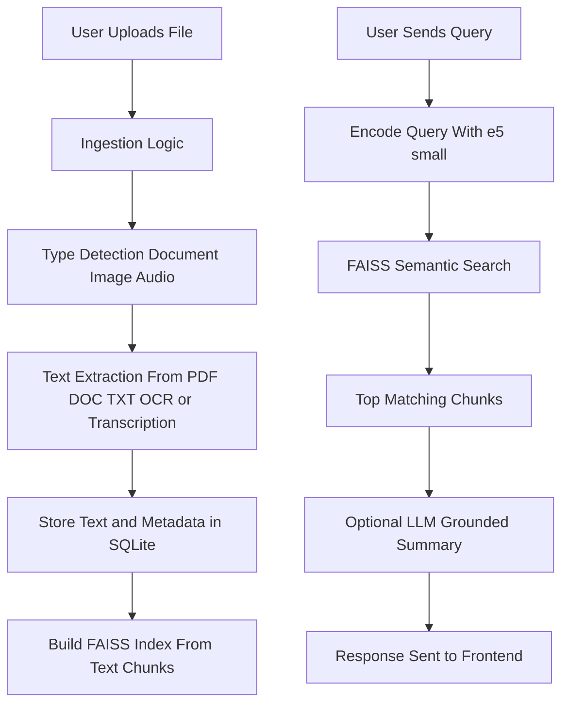

#  Multimodal RAG-Based Offline Chatbot

A **multimodal Retrieval-Augmented Generation (RAG) system** that lets you upload **documents, images, and audio**, extracts text using OCR and transcription, stores everything in **SQLite + FAISS**, and answers queries using **semantic search over local data**. Runs as a **Flask web app**, with optional **OpenAI Whisper + GPT-4o-mini** for cloud-assisted transcription and grounded summaries.

**Live Demo:** [https://huggingface.co/spaces/joshi-deepak08/RAG_based_offline_chatbot](https://huggingface.co/spaces/joshi-deepak08/RAG_based_offline_chatbot)


---

##  Folder Structure

```text
Multimodel_RAG_project/
│
├── main.py               # Flask app, RAG pipeline, API endpoints
├── requirements.txt      # Python dependencies
├── Dockerfile            # Container spec for Hugging Face Space
├── .dockerignore
├── templates/
│   └── index.html        # Frontend UI (upload + chat interface)
└── README.md
```

---

##  How to Run the Project Locally

### 1️⃣ Clone the repo

```bash
git clone https://github.com/JoshiDeepak08/Multimodel_RAG_project.git
cd Multimodel_RAG_project
```

### 2️⃣ Create and activate a virtual environment (recommended)

```bash
python -m venv venv
source venv/bin/activate      # macOS / Linux
# or
venv\Scripts\activate         # Windows
```

### 3️⃣ Install dependencies

```bash
pip install -r requirements.txt
```

> For **audio transcription** and **OCR**, you may also need:
>
> * `ffmpeg` installed on your system (for `pydub`)
> * Tesseract installed and available on PATH (for `pytesseract`)

### 4️⃣ Set environment variables (optional but recommended)

```bash
# For cloud transcription + LLM answers
export OPENAI_API_KEY="your_openai_key_here"
```

If `OPENAI_API_KEY` is **not** set:

* The app still works with local semantic search.
* Transcription falls back to local `faster-whisper` if installed.

### 5️⃣ Run the Flask app

```bash
python main.py
```

By default (like on Hugging Face), it binds to:

```text
http://0.0.0.0:7860
```

Locally, you can open:

```text
http://127.0.0.1:7860
```

---

##  Architecture & Design Decisions

### Core Components

* **Flask** – web server, REST API, and HTML rendering via Jinja (`templates/index.html`)
* **SQLite** – lightweight local DB for:

  * documents
  * text chunks
  * images
  * audio metadata
* **SentenceTransformers (`intfloat/e5-small-v2`)** – embeddings for semantic search
* **FAISS** – similarity search index over text chunks
* **PyMuPDF (`fitz`)** – PDF text and image extraction
* **python-docx + mammoth** – DOC/DOCX text extraction
* **PIL + pytesseract** – OCR for image files
* **faster-whisper** (optional) – offline audio transcription on CPU
* **OpenAI Whisper + GPT-4o-mini** (optional) – cloud transcription and grounded summarization
* **pydub** (optional) – audio duration metadata

### Design Choices

* **Local-first**: all documents, embeddings, and indices are stored locally (good for privacy and offline usage).
* **Multimodal ingestion**: PDFs, Word docs, plain text, images via OCR, and audio via transcription all end up as searchable text.
* **Two-phase pipeline**:

  * Ingestion (store & index)
  * Query (semantic search + optional LLM summary)
* **API-first architecture**: `/api/upload`, `/api/build_index`, `/api/query`, `/api/list_docs` make it easy to swap the frontend.

---

##  Approach

The goal of this project:

> “Bring **true multimodal RAG** to a **single-machine**, mostly offline setup.”

Key ideas:

1. Use **simple file uploads** to ingest arbitrary content.
2. Normalize everything into **text chunks** stored in SQLite.
3. Use **e5-small-v2** embeddings + FAISS for efficient semantic search.
4. Optionally use **LLMs only on top-N retrieved snippets** to keep cost and latency under control.
5. Keep the architecture **hackable** — easy to extend or replace pieces (e.g., different encoder, different LLM, new UI).

---

##  Pipeline Design

### 1. Ingestion Pipeline

1. User uploads a file via `/api/upload`.

2. `ingest_file_disk`:

   * Saves the file under `ingested_media/`
   * Computes `sha256` hash to dedupe
   * Detects type by extension:

     * `.pdf` → `process_pdf` (text + inline images)
     * `.docx` → `process_docx`
     * `.doc` → `process_doc`
     * `.txt` → direct read
     * image (`.png`, `.jpg`, etc.) → `ocr_image` via Tesseract
     * audio (`.mp3`, `.wav`, etc.) → `process_audio` (faster-whisper → OpenAI Whisper fallback)
   * Inserts document record into `documents` table.
   * Inserts text into `text_chunks` table (with metadata).
   * Inserts extracted images into `images` table.
   * Inserts audio metadata into `audios` table.

3. User triggers `/api/build_index`:

   * Reads all `text_chunks` from SQLite.
   * Splits long texts into overlapping subchunks via `_chunk_text`.
   * Encodes chunks with `e5-small-v2` to create embeddings.
   * Builds FAISS index (`IndexFlatIP`) and saves to `index_store/faiss_e5_small.index`.
   * Writes `id_mapping.jsonl` with metadata per FAISS vector.

### 2. Query Pipeline

1. Frontend sends `POST /api/query` with a `query` string.
2. `semantic_search(query, top_k)`:

   * Loads FAISS index + ID mapping.
   * Encodes query with `e5-small-v2`.
   * Searches FAISS for top-k chunks.
   * For each hit:

     * fetches file name from `documents` table
     * returns score, text snippet, and metadata.
3. `api_query` currently:

   * Fetches **one best hit** (top-1).
   * Ensures a `file_url` for preview/download.
   * Returns:

     * `hits`: list with one minimal item
     * `summary`: the snippet text (so UI can display it directly)
4. If an OpenAI key is configured, `generate_grounded_summary` can instead:

   * Construct a prompt from top-N snippets
   * Ask GPT-4o-mini to answer using **only** those snippets and include citations.

---

###  High-Level Flow (Mermaid)



---

##  Key Endpoints

* `GET /`
  Serves the main HTML UI (`templates/index.html`).

* `POST /api/upload`
  Upload and ingest a new file (doc/image/audio).

* `POST /api/build_index`
  Build FAISS index over all ingested text.

* `POST /api/query`
  Run semantic search + return best hit (and summary text).

* `GET /api/list_docs`
  List all documents with basic metadata.

* `GET /media/<filename>`
  Serve original media files for preview/download.

---

##  Challenges & Trade-Offs

### 1. CPU-Only Environment

* `faster-whisper` is forced to `"cpu"` with `int8` compute type
* Trade-off: slightly slower transcription, but no GPU requirement.

### 2. Multimodal Complexity

* PDFs with many images
* Large audio files
* Big documents
  ➡ Need to balance **index build time** vs completeness.

### 3. Storage Structure

* All text in SQLite + FAISS
* All media in folder `ingested_media/`
  ➡ Simple, but not distributed; tuned for single-machine use.

### 4. LLM Cost vs Offline Capability

* By default, semantic search works **fully offline** once embeddings are built.
* LLM-powered summaries require **OpenAI API key** and internet.
  ➡ You can choose purely extractive results (no API cost) or richer abstractive summaries.

### 5. Chunking Strategy

* Chunk size and overlap directly affect recall and relevance.
* Current defaults (`max_chars=1000`, `overlap=200`) are a trade-off between:

  * not losing context
  * not creating too many vectors

---

